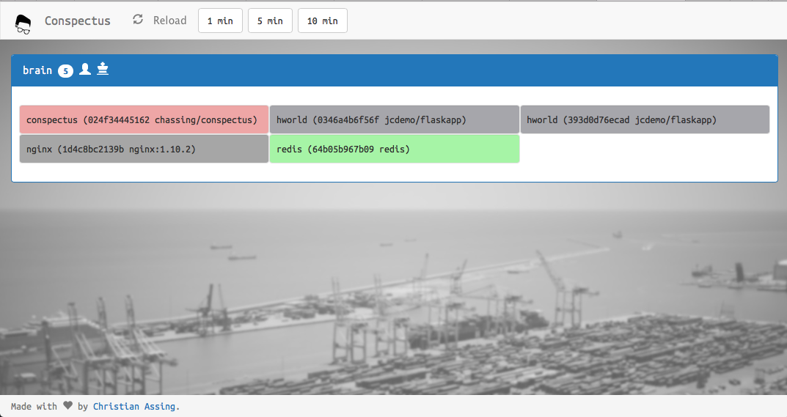

# Conspectus

Conspectus is a small shiny overview page for your Docker Swarm cluster.

## Usage

As prerequisite setup your swarm cluster before you run Conspectus, see [Docker Swarm Documentation](https://docs.docker.com/engine/swarm/).

Run Conspectus as docker service and please take care that you run conspectus on a swarm manager and bind mount the docker socket too.

    $ docker service create --name conspectus -p 8000:5000 --mount src=/var/run/docker.sock,dst=/var/run/docker.sock,type=bind --constraint "node.role == manager" conspectus:latest

    ✨🍻😎✨

Point your browser to http://cluster-manager:8000.

